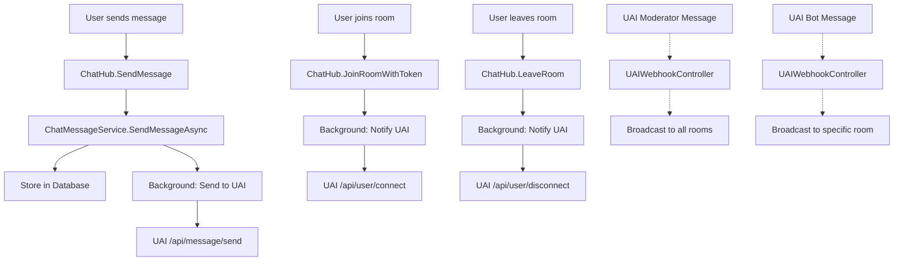

# UAI Integration Architecture

## Overview

The Wagl Backend now includes full integration with UAI (Unanimous AI) service for enhanced chat functionality. This integration enables real-time communication between your chat system and UAI's AI moderation and bot services.

## ✅ Integration Status: **LIVE & TESTED**

🧪 **Test Results (2025-09-18):**
- ✅ UAI Health Check: SUCCESS (HTTP 200)
- ✅ UAI Message Send: SUCCESS (HTTP 200)
- ✅ UAI User Connect: SUCCESS (HTTP 200)
- ✅ UAI User Disconnect: SUCCESS (HTTP 200)

## Architecture Overview



## Current Integration (Production Ready)

### ✅ **Outbound Communication (Working)**

| Event | Endpoint | Trigger | Status |
|-------|----------|---------|--------|
| User sends message | `/api/message/send` | After storing message | ✅ Active |
| User joins room | `/api/user/connect` | After successful room join | ✅ Active |
| User leaves room | `/api/user/disconnect` | After leaving room | ✅ Active |
| Health check | `/api/health` | On-demand testing | ✅ Active |

### 🔄 **Inbound Communication (Placeholder)**

| Message Type | Endpoint | Target | Status |
|-------------|----------|--------|--------|
| Moderator messages | `/api/v1/uai/webhook/moderator-message` | All rooms in session | 🚧 Ready for UAI |
| Bot messages | `/api/v1/uai/webhook/bot-message` | Specific room | 🚧 Ready for UAI |

## Configuration

### UAI Settings (`appsettings.json`)

```json
{
  "UAI": {
    "BaseUrl": "https://thinkscape-test-server.unanimous.ai/unity-api",
    "TestSessionId": "54.196.26.13",
    "AvailableRooms": [0, 1, 2],
    "DefaultUrlParams": "?source=web&version=1.0",
    "TimeoutMs": 5000,
    "EnableIntegration": true,
    "RetryPolicy": {
      "MaxAttempts": 3,
      "BackoffMs": 1000,
      "EnableExponentialBackoff": true
    }
  }
}
```

### Environment Control

- **Enable Integration**: Set `UAI.EnableIntegration` to `true/false`
- **Disable for Testing**: Set to `false` to run chat without UAI
- **Production Safety**: System works normally even if UAI is down

## Data Mapping

### Session Mapping
- **Your Sessions** → **UAI Session**: `"54.196.26.13"` (test environment)
- All your chat sessions currently map to this single UAI test session

### Room Mapping
- **Your RoomIds** → **UAI Rooms**: Distributed across rooms 0, 1, 2
- Uses consistent hashing: `Math.Abs(roomId.GetHashCode()) % 3`
- Ensures same room always maps to same UAI room

### User Mapping
- **Your Participant.Id** (GUID) → **UAI UserID** (long)
- Uses first 8 bytes of GUID: `Math.Abs(BitConverter.ToInt64(guidBytes, 0))`
- Consistent mapping ensures same participant = same UAI user ID

## Message Flow

### User Message Flow

```
1. User types message in chat
2. ChatHub.SendMessage() receives it
3. ChatMessageService.SendMessageAsync():
   - Stores message in your database
   - Returns immediately to user (fast UX)
   - Background task: Sends to UAI
4. UAI processes message
5. (Future) UAI sends moderator/bot response via webhook
```

### User Join/Leave Flow

```
1. User joins room via invite token
2. ChatHub.JoinRoomWithToken():
   - Processes room join
   - Updates participant tracking
   - Background task: Notifies UAI /api/user/connect
3. User leaves room
4. ChatHub.LeaveRoom():
   - Marks participant as left
   - Background task: Notifies UAI /api/user/disconnect
```

## Database Schema

### Enhanced ChatMessage Entity

```csharp
public class ChatMessage
{
    // Existing properties...
    public MessageType MessageType { get; set; } = MessageType.UserMessage;
    public string? ExternalMessageId { get; set; }  // UAI message ID
    public Guid? TriggerMessageId { get; set; }     // What triggered this message
}
```

### MessageType Enum

```csharp
public enum MessageType
{
    UserMessage = 1,        // ✅ Active
    ModeratorMessage = 2,   // 🚧 Ready for UAI
    BotMessage = 3          // 🚧 Ready for UAI
}
```

## API Endpoints

### Your Webhook Endpoints (for UAI to call)

```
GET  /api/v1/uai/webhook/health                    # Health check
POST /api/v1/uai/webhook/moderator-message         # Moderator messages (placeholder)
POST /api/v1/uai/webhook/bot-message              # Bot messages (placeholder)
```

### UAI Endpoints (that you call)

```
POST https://thinkscape-test-server.unanimous.ai/unity-api/54.196.26.13/api/health
POST https://thinkscape-test-server.unanimous.ai/unity-api/54.196.26.13/api/message/send
POST https://thinkscape-test-server.unanimous.ai/unity-api/54.196.26.13/api/user/connect
POST https://thinkscape-test-server.unanimous.ai/unity-api/54.196.26.13/api/user/disconnect
```

## Error Handling

### Graceful Degradation
- **UAI Down**: Chat continues working normally
- **Network Issues**: Background tasks fail silently with logging
- **Configuration Issues**: Integration disables automatically

### Logging
- All UAI operations are logged with appropriate levels
- Success: `LogInformation`
- Failures: `LogWarning` (non-blocking) or `LogError` (blocking issues)
- Debug: `LogDebug` for detailed request/response data

### Retry Policy
- **Max Attempts**: 3 retries with exponential backoff
- **Backoff**: Starts at 1000ms, doubles each retry
- **Timeout**: 5 seconds per request

## Security

### Current Implementation
- **Webhook Endpoints**: Currently `[AllowAnonymous]` (development only)
- **UAI Requests**: No authentication required by UAI
- **HTTPS**: All UAI communication over HTTPS

### Future Security (When UAI implements)
- Webhook signature validation
- API key authentication
- Rate limiting protection
- Request payload validation

## Testing

### Manual Testing Script
```bash
./test-uai-integration.sh
```

### Integration Verification
1. **Health Check**: Verifies UAI service availability
2. **Message Send**: Tests message forwarding to UAI
3. **User Connect**: Tests user join notifications
4. **User Disconnect**: Tests user leave notifications

## Future Enhancements

### When UAI Implements Webhooks
1. **Moderator Messages**: UAI sends warnings/announcements to all rooms
2. **Bot Messages**: UAI sends AI responses to specific rooms
3. **Webhook Authentication**: Secure webhook validation
4. **Message Acknowledgments**: Delivery confirmation from UAI

### Potential Features
- **Real-time Moderation**: Automatic content filtering
- **AI Chatbots**: Smart responses to user questions
- **Analytics Integration**: User behavior insights from UAI
- **Multi-Session Support**: When UAI supports session creation

## Monitoring & Maintenance

### Key Metrics to Monitor
- UAI response times and success rates
- Message delivery success rates
- User connect/disconnect success rates
- Error rates and patterns

### Health Checks
- UAI service availability
- Webhook endpoint accessibility
- Database performance with new columns
- Background task performance

## Development Notes

### Service Registration
```csharp
// In ServiceCollectionExtensions.cs
services.AddHttpClient<IUAIIntegrationService, UAIIntegrationService>();
services.AddScoped<IUAIWebhookService, UAIWebhookService>();
services.Configure<UAIConfiguration>(configuration.GetSection(UAIConfiguration.SectionName));
```

### Key Files Created/Modified
- `UAIIntegrationService.cs` - Main UAI communication
- `UAIWebhookService.cs` - Webhook message processing
- `UAIWebhookController.cs` - Webhook endpoints
- `ChatMessageService.cs` - Enhanced with UAI integration
- `ChatHub.cs` - Enhanced with UAI notifications
- `ChatMessage.cs` - Added UAI tracking fields
- `UAIConfiguration.cs` - Configuration model
- Various UAI DTOs in `/Request/UAI/` folder

---

## Quick Start

1. **Enable Integration**: Ensure `UAI.EnableIntegration = true` in config
2. **Test Connection**: Run `./test-uai-integration.sh`
3. **Deploy**: Your chat now automatically integrates with UAI
4. **Monitor**: Check logs for UAI integration status

The integration is **production-ready** and will enhance your chat experience with AI-powered moderation and bot capabilities as UAI evolves their service.